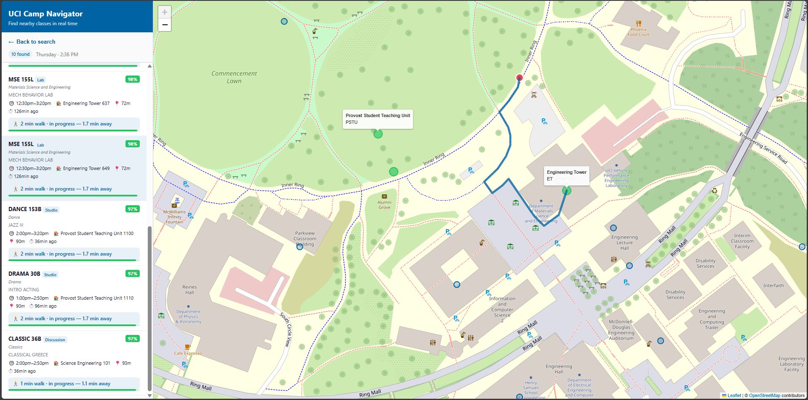

# Campus Navigator

A location-aware web app that surfaces the UC Irvine class sections meeting near you in the next hour, ranked by how close and how soon they are, with optional keyword search. Built in Python.

<!-- TODO(jovan): add a screenshot or short GIF of the running app (the map with your location
     pin and ranked result cards). Run `python -m src.api`, capture it, save to assets/demo.png,
     and uncomment the line below. -->
<!--  -->

## Overview

Campus Navigator answers a specific question: "what classes are meeting close to me, soon?" You set an origin (your real GPS location or a campus building you pick), choose a day and time, and the app returns the nearby class sections that are about to start or already in progress, ranked and plotted on a map. It is a location- and time-aware class finder, not a turn-by-turn router: it ranks and locates class meetings, it does not compute walking directions between two points.

Under the hood, a Flask backend loads campus buildings and class meetings from CSV into memory, filters them by day, a look-ahead time window, and a straight-line distance cutoff, then scores each candidate. The frontend is a Leaflet map over OpenStreetMap tiles.

## Features

- **Find nearby class sections** meeting within a look-ahead window (default 60 minutes) and a distance cutoff (default 1200 m) of your location, including ones already in progress (toggleable).
- **Real device location** via the browser Geolocation API (GPS), or choose any campus building as your origin from a dropdown.
- **Keyword search** over course titles and department names, scored with BM25 and blended into the ranking.
- **Filters** for department, course level (lower / upper / grad), and section type (lecture, lab, discussion, and so on).
- **Interactive map** (Leaflet + OpenStreetMap) with building markers, a "you are here" pin, and result highlighting, alongside ranked cards that show the time, distance, and a per-factor score breakdown.
- **CLI demo** (`src/demo.py`) that runs two fixed scenarios and prints an explainability breakdown of why each result ranked where it did.

There is no route drawing or shortest-path navigation; distance is a straight-line ranking signal, not a walking route.

## How It Works

- **Data pipeline.** A WebSoc scraper (`src/websoc/`) pulls UCI's published class schedule; `scripts/parse_websoc_json.py` turns the raw JSON into `data/meetings.csv`, and `scripts/scrape_buildings.py` collects building coordinates into `data/buildings.csv`.
- **Filtering.** For a given day, time, and origin, candidates are kept only if they meet that day, start within the look-ahead window (or are ongoing), and fall within the straight-line (haversine) distance cutoff.
- **Ranking.** Each candidate gets a final score that blends a time-proximity score and a distance score; when a keyword query is present, a BM25 text-relevance score is blended in as well, using configurable weights (`RankConfig`). Results are sorted and the top-k are returned.
- **BM25.** The text index scores each meeting's `title + department` against the query using standard BM25 (k1 = 1.5, b = 0.75), normalized to [0, 1] before blending.

## Tech Stack

Python with Flask for the API. The frontend is vanilla HTML/CSS/JavaScript using Leaflet.js and OpenStreetMap tiles. The scraper uses `requests`. There is no database; data lives in CSV files and is loaded into memory at startup. Dependencies are in `requirements.txt` (`flask`, `requests`).

## Project Structure

```text
├─ src/
│  ├─ api.py                    # Flask API: /api/rank, /api/buildings, /api/departments
│  ├─ ranker.py                 # candidate filtering + weighted time/distance/text scoring (haversine)
│  ├─ search.py                 # BM25 index over course titles + departments
│  ├─ models.py                 # Building, Meeting, RankedResult dataclasses
│  ├─ io.py                     # CSV loaders for buildings and meetings
│  ├─ demo.py                   # CLI demo: two scenarios with an explainability breakdown
│  └─ websoc/                   # WebSoc (UCI schedule) scraper package
├─ scripts/
│  ├─ parse_websoc_json.py      # WebSoc JSON -> data/meetings.csv
│  └─ scrape_buildings.py       # collect building coordinates -> data/buildings.csv
├─ frontend/
│  ├─ index.html
│  ├─ app.js                    # Leaflet map, geolocation, search, result rendering
│  └─ style.css
├─ data/
│  ├─ buildings.csv             # code, name, lat, lon
│  ├─ meetings.csv              # class sections: id, course, title, dept, days, times, building, room, term
│  ├─ websoc_raw.json           # raw scraped schedule
│  └─ sample_scenarios.csv
├─ requirements.txt
└─ README.md
```

## Running it

From the repo root:

```text
pip install -r requirements.txt
python -m src.api        # serves the web app at http://localhost:5000
```

To run the command-line demo instead of the web UI:

```text
python -m src.demo
```

The class and building data are already checked in under `data/`. To refresh them, run the WebSoc scraper and `scripts/parse_websoc_json.py` to regenerate `data/meetings.csv`.

## Contribution

Group final project for UC Irvine CS 125. The large majority of the code is mine (16 of the 19 commits): the ranking engine, the BM25 search index, the Flask API, the Leaflet web UI, the CLI demo, and the building and meeting data parsing. A teammate contributed the initial WebSoc scraper and the first raw schedule data file.
